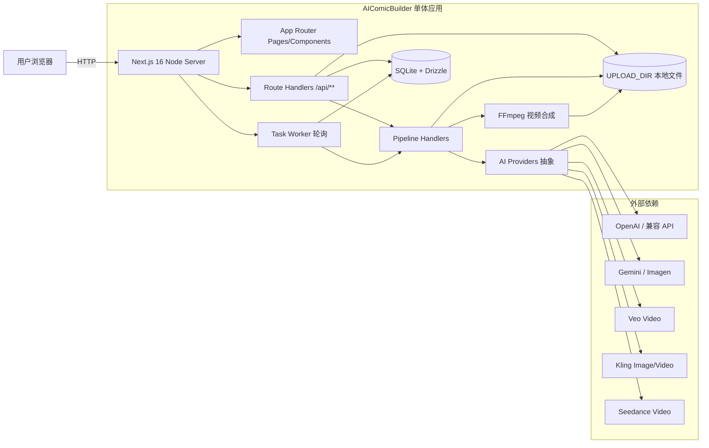
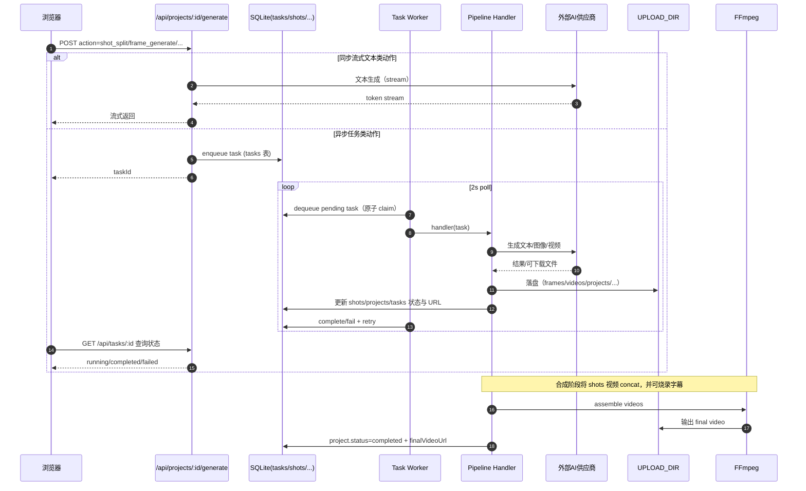

# 技术架构分析报告（AI Comic Builder）

> 范围：当前仓库代码与随仓文档（不含线上运行数据与真实流量指标）。  
> 结论：系统是“同仓单体（Next.js App Router）+ 内置轻量任务队列（SQLite 表）+ 本地文件存储 + 外部 AI/FFmpeg 处理”的架构形态，适合单机/小团队迭代与快速验证；若面向生产与多租户，需要补齐鉴权、成本控制、可观测性与可扩展的数据/任务基础设施。

## 1. 系统架构层面

### 1.1 架构模式判定

- 架构形态：同仓单体（Monorepo 单应用）  
  - 前端：Next.js 16 App Router 页面与组件  
  - 后端：Next.js Route Handlers（`src/app/api/**/route.ts`）  
  - 异步任务：同进程 worker（启动时 bootstrap 后轮询 SQLite `tasks` 表）  
- 运行形态：Node server（Next standalone 输出），Docker 镜像内集成 FFmpeg 与 CJK 字体（用于字幕烧录）。

### 1.2 核心组件与职责边界

- Web UI（页面与交互）
  - 页面入口：[layout.tsx](file:///Users/yxtwang/dev/gitee/person/AIComicBuilder/src/app/%5Blocale%5D/layout.tsx)、[dashboard/page.tsx](file:///Users/yxtwang/dev/gitee/person/AIComicBuilder/src/app/%5Blocale%5D/(dashboard)/page.tsx)
  - 编辑器组件：`src/components/editor/*`（剧本、角色、分镜、预览）
  - 状态管理：Zustand（[project-store.ts](file:///Users/yxtwang/dev/gitee/person/AIComicBuilder/src/stores/project-store.ts)、[model-store.ts](file:///Users/yxtwang/dev/gitee/person/AIComicBuilder/src/stores/model-store.ts)）
- API 层（业务动作入口）
  - 项目/分镜/角色 CRUD：`src/app/api/projects/**`
  - 统一“生成动作”分发入口：[generate/route.ts](file:///Users/yxtwang/dev/gitee/person/AIComicBuilder/src/app/api/projects/%5Bid%5D/generate/route.ts#L93-L197)
  - 任务查询：`src/app/api/tasks/[id]/route.ts`
  - 上传与静态读：上传写本地 + 数据库记录；读取通过 `/api/uploads/*`（[uploads route](file:///Users/yxtwang/dev/gitee/person/AIComicBuilder/src/app/api/uploads/%5B...path%5D/route.ts)）
- 任务队列（DB 表队列）
  - 入队/出队/重试：[queue.ts](file:///Users/yxtwang/dev/gitee/person/AIComicBuilder/src/lib/task-queue/queue.ts)
  - Worker 轮询执行（默认 2s）：[worker.ts](file:///Users/yxtwang/dev/gitee/person/AIComicBuilder/src/lib/task-queue/worker.ts)
- Pipeline（流水线业务编排）
  - handler 注册：[pipeline/index.ts](file:///Users/yxtwang/dev/gitee/person/AIComicBuilder/src/lib/pipeline/index.ts)
  - 阶段任务：脚本解析/角色提取/四视图/分镜拆分/帧图生成/视频生成/视频合成：`src/lib/pipeline/*`
- AI Providers（外部模型供应商抽象与落盘）
  - Provider factory（按项目模型配置覆盖）：[provider-factory.ts](file:///Users/yxtwang/dev/gitee/person/AIComicBuilder/src/lib/ai/provider-factory.ts)
  - 实现：OpenAI / Gemini / Veo / Kling / Seedance：`src/lib/ai/providers/*`
- 数据与存储
  - SQLite + Drizzle ORM：[schema.ts](file:///Users/yxtwang/dev/gitee/person/AIComicBuilder/src/lib/db/schema.ts)、[db/index.ts](file:///Users/yxtwang/dev/gitee/person/AIComicBuilder/src/lib/db/index.ts)
  - 本地文件存储（`UPLOAD_DIR`）：帧图/视频/版本化产物
- 视频处理
  - FFmpeg concat + 字幕烧录：[ffmpeg.ts](file:///Users/yxtwang/dev/gitee/person/AIComicBuilder/src/lib/video/ffmpeg.ts)

### 1.3 系统拓扑图（含关键交互）

### 1.4 关键流程（从“生成”到“合成”）

## 2. 技术栈梳理

### 2.1 技术清单（含版本）

| 层级 | 技术/组件 | 版本/形态 | 备注 |
|---|---|---|---|
| 运行时 | Node.js | Docker: `node:20-alpine`；README 要求 18+ | 生产建议锁定 LTS（与依赖 native addon 兼容） |
| 前端框架 | Next.js | `16.1.6` | App Router + Route Handlers；`output: "standalone"` |
| UI | React / ReactDOM | `19.2.3` / `19.2.3` | 与 Next 16 对齐 |
| CSS | Tailwind CSS | `^4` | PostCSS 插件 `@tailwindcss/postcss` |
| 组件库 | Base UI | `^1.2.0` | 依赖稳定性需要持续关注 |
| UI 体系 | shadcn | `^4.0.2` | 代码生成/模板体系，实际组件在 `src/components/ui/*` |
| 国际化 | next-intl | `^4.8.3` | 中间件路由：[middleware.ts](file:///Users/yxtwang/dev/gitee/person/AIComicBuilder/src/middleware.ts) |
| 状态管理 | Zustand | `^5.0.11` | 本地持久化模型配置：[model-store.ts](file:///Users/yxtwang/dev/gitee/person/AIComicBuilder/src/stores/model-store.ts) |
| 数据库 | SQLite | 单文件（`DATABASE_URL=file:...`） | 通过 WAL 提升并发读；外键开启 |
| ORM | Drizzle ORM / drizzle-kit | `^0.45.1` / `^0.31.9` | Schema：[schema.ts](file:///Users/yxtwang/dev/gitee/person/AIComicBuilder/src/lib/db/schema.ts)；迁移：`/drizzle/*.sql` |
| SQLite 驱动 | better-sqlite3 | `^12.6.2` | native addon；Next config 将其标记为外置包 |
| AI SDK | `ai` / `@ai-sdk/openai` / `@ai-sdk/google` | `^6.0.116` / `^3.0.41` / `^3.0.43` | 主要用于流式文本等能力 |
| AI Provider SDK | openai / @google/genai | `^6.27.0` / `^1.44.0` | 供应商实现：`src/lib/ai/providers/*` |
| 视频处理 | ffmpeg（系统包）+ fluent-ffmpeg | Docker: `apk add ffmpeg`；JS: `^2.1.3` | 字幕烧录依赖 libass；镜像额外装 `font-noto-cjk` |
| 资源归档 | archiver | `^7.0.1` | 项目资源 zip 打包下载 |
| 工具链 | TypeScript / ESLint | `^5` / `^9` | TS 类型来自 `@types/*` |
| 包管理 | pnpm | corepack 安装 latest | Docker 构建阶段 `--frozen-lockfile` |

参考：
- 依赖版本来源：[package.json](file:///Users/yxtwang/dev/gitee/person/AIComicBuilder/package.json)
- 构建与运行来源：[Dockerfile](file:///Users/yxtwang/dev/gitee/person/AIComicBuilder/Dockerfile)、[next.config.ts](file:///Users/yxtwang/dev/gitee/person/AIComicBuilder/next.config.ts)

### 2.2 成熟度、活跃度与许可风险（摘要）

- 成熟度/生态活跃度（主观分级）
  - 高：Next.js / React / Tailwind / SQLite / FFmpeg
  - 中：Drizzle ORM、Zustand、OpenAI SDK、archiver
  - 中-偏新：`ai`（Vercel AI SDK 体系）、`@google/genai`（Google GenAI SDK）、Base UI
  - 强依赖外部供应商：Seedance/Kling/Veo（接口稳定性、配额、价格、合规均是主要不确定性）
- 许可风险（需重点关注）
  - 项目自身许可：Apache-2.0（[LICENSE](file:///Users/yxtwang/dev/gitee/person/AIComicBuilder/LICENSE)）
  - FFmpeg：Docker 直接分发二进制包，可能包含 GPL/LGPL 组件，分发与商用合规需要单独确认（尤其是镜像公开发布/闭源商业场景）
  - 第三方依赖许可：当前仓库未提供依赖许可清单与扫描结果，建议引入自动化扫描（见“风险清单 / 改进路线图”）。

### 2.3 技术雷达（Adopt/Trial/Assess/Hold）

| Ring | 技术项 | 理由（面向当前业务形态） |
|---|---|---|
| Adopt | Next.js App Router、React 19、Tailwind 4、Drizzle+SQLite（单机）、Docker Standalone | 产研一体、迭代快、部署简化，满足“单机/小规模”主目标 |
| Trial | “DB 表队列 + 内置 worker”、Vercel AI SDK、fluent-ffmpeg、Base UI | 能解决当前问题，但扩展性/稳定性/可观测性需投入后再规模化 |
| Assess | 多供应商视频模型集成（Seedance/Kling/Veo） | 供应商波动大，需建立接口契约、降级与成本控制再推广 |
| Hold | `x-user-id` 头作为身份、local disk 作为核心产物存储（多实例）、同进程轮询 worker（生产多副本） | 面向生产会引入安全、多租户隔离、扩展与一致性风险 |

## 3. 数据架构分析

### 3.1 数据库类型与数量

- 数据库：SQLite 单文件（默认 `./data/aicomic.db`，Docker 默认 `/app/data/aicomic.db`）
- 连接与初始化：better-sqlite3 + Drizzle；启用 WAL 与外键约束（[db/index.ts](file:///Users/yxtwang/dev/gitee/person/AIComicBuilder/src/lib/db/index.ts#L20-L46)）
- 迁移策略：启动时自动执行 Drizzle migrator（[bootstrap.ts](file:///Users/yxtwang/dev/gitee/person/AIComicBuilder/src/lib/bootstrap.ts#L12-L23)）

### 3.2 数据模型（核心实体与关系）

Schema 定义见 [schema.ts](file:///Users/yxtwang/dev/gitee/person/AIComicBuilder/src/lib/db/schema.ts)：
- projects（项目）：`status`、`generationMode`、`finalVideoUrl`、`userId`
- storyboard_versions（分镜版本）：`projectId` + `versionNum`
- shots（镜头）：`projectId`、`versionId`、帧图/视频相关字段、`status`
- characters（角色）：`projectId`、`referenceImage`、`visualHint`
- dialogues（对白）：`shotId`、`characterId`
- tasks（异步任务队列）：`type/status/payload/result/error/retries/scheduledAt`

关系特征：
- 大部分外键启用级联删除（projects 删除会级联清理 characters/shots/versions/tasks 等）
- 产物（帧图/视频）路径/URL 以字符串形式落库，通过 [upload-url.ts](file:///Users/yxtwang/dev/gitee/person/AIComicBuilder/src/lib/utils/upload-url.ts) 映射到 `/api/uploads/*` 提供访问

### 3.3 分库分表、缓存、消息队列现状

- 分库分表：无
- 缓存：无（无 Redis/内存缓存层，主要依赖 SQLite + 文件系统）
- 消息队列：无独立 MQ；使用 `tasks` 表实现轻量队列（[queue.ts](file:///Users/yxtwang/dev/gitee/person/AIComicBuilder/src/lib/task-queue/queue.ts)）

### 3.4 一致性、可扩展性与容灾能力评估

- 一致性
  - DB 内一致性：单机 SQLite + 外键约束，CRUD 一致性较强
  - DB 与文件系统的一致性：写文件与更新 DB 不在同一事务中（例如上传先写文件再更新 shot 字段），存在“DB 指向不存在文件/文件孤儿”的边缘情况，需要补偿策略（定期清理或两阶段写入）
  - 任务状态一致性：dequeue 使用原子 claim（UPDATE + 子查询）降低并发竞态（[queue.ts](file:///Users/yxtwang/dev/gitee/person/AIComicBuilder/src/lib/task-queue/queue.ts#L29-L47)），但多进程/多实例场景会受到 SQLite 写锁与共享存储语义影响
- 可扩展性（当前瓶颈）
  - 异步任务：单 worker 串行执行；外部视频生成/下载/FFmpeg 合成均为长耗时操作，吞吐受限
  - 存储：`UPLOAD_DIR` 为本地目录，天然限制横向扩展与容灾（多实例需要共享存储/对象存储）
  - DB：SQLite 适合单机与中低并发；若读写并发提升，锁竞争会显著上升
- 容灾与备份（现状）
  - 代码层未实现备份/恢复/快照；可通过对 `data/*.db` 与 `uploads/` 做定期备份满足基础容灾
  - 建议在“路线图”中将备份策略产品化（备份校验、加密、RPO/RTO 目标）。

## 4. 非功能性指标评估

> 说明：仓库中没有真实运行指标、容量规划与压测报告，因此“现状”部分以可从代码推导的能力上限 + 明确的缺口描述为主；基准为行业常见 SaaS/内部平台参考范围，用于对齐差距与优先级。

### 4.1 性能（Performance）

- 现状（推导）
  - CRUD/查询类 API：主要为 SQLite 简单读写，理论可达到毫秒级 DB 时间；但缺少分页/索引声明与保护性限流，性能受数据规模与并发影响较大
  - 异步任务启动延迟：worker 轮询间隔固定 2s（[worker.ts](file:///Users/yxtwang/dev/gitee/person/AIComicBuilder/src/lib/task-queue/worker.ts#L4-L4)），任务从入队到开始处理的排队延迟 ≈ 0~2s + 前序任务耗时
  - 任务吞吐：单 worker 串行（同一时间只处理 1 个任务）
- 行业基准（参考）
  - 交互类 API：p95 < 200ms（服务端处理时间），p99 < 500ms
  - 异步任务：排队延迟 p95 < 1s（有独立 worker/队列时）
- 主要瓶颈点
  - 单 worker 串行 + 外部 AI/下载/FFmpeg 长耗时
  - SQLite 单文件写锁带来的并发上限
  - 大文件读写（视频/帧图）对磁盘 IO 与内存（`readFileSync`）的压力（见 [uploads route](file:///Users/yxtwang/dev/gitee/person/AIComicBuilder/src/app/api/uploads/%5B...path%5D/route.ts#L36-L40)）

### 4.2 可用性（Availability）

- 现状
  - 单实例假设明显：本地 DB + 本地 uploads；无健康检查、无就绪探针、无自动降级策略（如供应商不可用时的熔断/降级）
  - 启动时自动迁移 DB（[bootstrap.ts](file:///Users/yxtwang/dev/gitee/person/AIComicBuilder/src/lib/bootstrap.ts#L12-L23)），迁移失败可能影响启动可用性
- 行业基准（参考）
  - 内部工具：99.5%~99.9%
  - 面向外部用户的 SaaS：≥99.9%（视业务而定）
- 主要瓶颈点
  - 单点（实例/磁盘/DB 文件）无冗余
  - 外部供应商波动直接影响端到端可用性（无熔断与降级）

### 4.3 伸缩性（Scalability）

- 现状
  - 计算伸缩：主要靠垂直扩容（更大 CPU/内存）；横向扩容会引入“多实例 worker + 本地存储不一致”问题
  - 存储伸缩：uploads 本地目录不可横向；需要共享文件系统或对象存储
- 行业基准（参考）
  - 支持按负载水平扩缩（worker 与 web 分离），关键路径无单点资源锁
- 主要瓶颈点
  - 任务队列与 worker 同进程，且队列基于 SQLite
  - 产物存储是本地文件

### 4.4 安全性（Security）

- 现状（高风险项）
  - 无鉴权与会话：服务端仅从 `x-user-id` 头读取“用户标识”（[get-user-id.ts](file:///Users/yxtwang/dev/gitee/person/AIComicBuilder/src/lib/get-user-id.ts)），缺少真实身份认证、签名与权限校验
  - 缺少限流/成本保护：生成动作与供应商调用可能导致成本型攻击或误操作
  - 秘钥管理：依赖环境变量注入（合理），但缺少权限最小化与审计/轮换机制描述
- 行业基准（参考）
  - 至少具备：认证（OIDC/JWT/Session）、授权（RBAC/ABAC）、审计日志、限流与配额、输入校验与安全头配置
- 主要瓶颈点
  - 多租户隔离缺失（用户可伪造 header，越权访问/写入他人项目）

### 4.5 可维护性（Maintainability）

- 现状
  - 优点：领域模块划分清晰（pipeline/provider/db/task-queue），接口集中（[provider-factory.ts](file:///Users/yxtwang/dev/gitee/person/AIComicBuilder/src/lib/ai/provider-factory.ts)），便于新增供应商或流水线阶段
  - 缺口：未看到自动化测试/契约测试/端到端测试；错误处理与重试策略较粗粒度；部分文件 IO 使用同步 API
- 行业基准（参考）
  - 单元测试覆盖关键规则；外部供应商用契约/模拟；关键链路具备可回放与可重试语义

### 4.6 可观测性（Observability）

- 现状
  - 基本仅 `console.log/error`（例如 worker poll 错误：[worker.ts](file:///Users/yxtwang/dev/gitee/person/AIComicBuilder/src/lib/task-queue/worker.ts#L37-L39)）
  - 无统一日志结构（traceId/projectId/taskId）、无指标（队列长度、任务耗时、外部调用耗时）、无分布式追踪
- 行业基准（参考）
  - Golden Signals：延迟、流量、错误、饱和度；任务系统额外关注队列长度、成功率、重试率与成本
- 主要瓶颈点
  - 排障成本高；无法做容量规划与 SLA/SLO 管控

## 5. 交付物

### 5.1 风险清单（Top）

| 风险 | 等级 | 影响 | 证据/现状 | 建议措施（摘要） |
|---|---|---|---|---|
| 无鉴权/越权风险 | 高 | 数据泄露/被篡改/成本失控 | `x-user-id` 可伪造（[get-user-id.ts](file:///Users/yxtwang/dev/gitee/person/AIComicBuilder/src/lib/get-user-id.ts)） | 引入认证与授权；项目级 owner 校验；写操作需要权限 |
| 成本型攻击/滥用 | 高 | API 调用费用失控 | 生成接口无配额/限流 | 全局与用户级限流；供应商配额与预算；生成动作审批/队列配额 |
| 单机单点（DB+uploads） | 高 | 宕机/磁盘损坏即不可用 | SQLite 单文件 + 本地目录 | 明确备份/恢复；分离对象存储；规划可横向的 DB/队列 |
| 任务系统吞吐受限 | 中 | 用户等待长、并发低 | 单 worker 串行 + 2s poll | web/worker 分离；引入队列系统；并行 worker（受限资源隔离） |
| 可观测性缺失 | 中 | 事故定位慢、无法优化 | 仅 console 日志 | 引入结构化日志/指标/追踪；任务级 traceId |
| FFmpeg 分发许可不确定 | 中 | 合规风险 | 镜像内直接安装 ffmpeg 包 | 输出 SBOM + 许可扫描；确认 ffmpeg 编译许可；必要时替换或隔离分发方式 |
| 文件读接口可枚举 | 中 | 产物泄露 | `/api/uploads/*` 无鉴权 | 对资源 URL 加签/鉴权；分桶隔离；按 project/user 校验 |
| DB 与文件一致性缺口 | 低-中 | 产物丢失/脏数据 | 写文件与写库非事务 | 引入补偿清理；写入两阶段；任务幂等与回滚策略 |

### 5.2 改进路线图（优先级）

- P0（必须先做，阻断生产风险）
  - 认证与授权：替换 `x-user-id` 为真实身份；项目/资源访问控制；写接口鉴权
  - 成本与滥用控制：生成接口限流/配额；供应商调用统一封装（超时、重试、熔断、降级、预算）
  - 可观测性底座：结构化日志（taskId/projectId/traceId）、关键指标（队列长度/成功率/耗时）、基础告警
- P1（让系统可扩展与稳定）
  - 任务系统解耦：将 worker 从 web 进程拆出；引入独立队列（或至少支持多 worker 并发 + 资源隔离）
  - 存储升级：uploads 迁移到对象存储（S3/OSS/GCS）；资源 URL 改为签名访问
  - 数据库升级/策略：容量增长时从 SQLite 迁移到 Postgres（或引入读写分离与索引设计）
- P2（体验与效率提升）
  - 任务幂等与可回放：按阶段记录输入/输出与可重试点；失败定位与一键重跑
  - 供应商适配治理：统一模型能力描述（速率/分辨率/价格）；模型切换与灰度；契约测试
  - 安全与合规：SBOM、依赖许可扫描、密钥轮换与审计策略

### 5.3 输出物路径

- 报告：`docs/tech-architecture-analysis-report.md`
- 分享材料：`docs/tech-architecture-sharing-30min.md`
